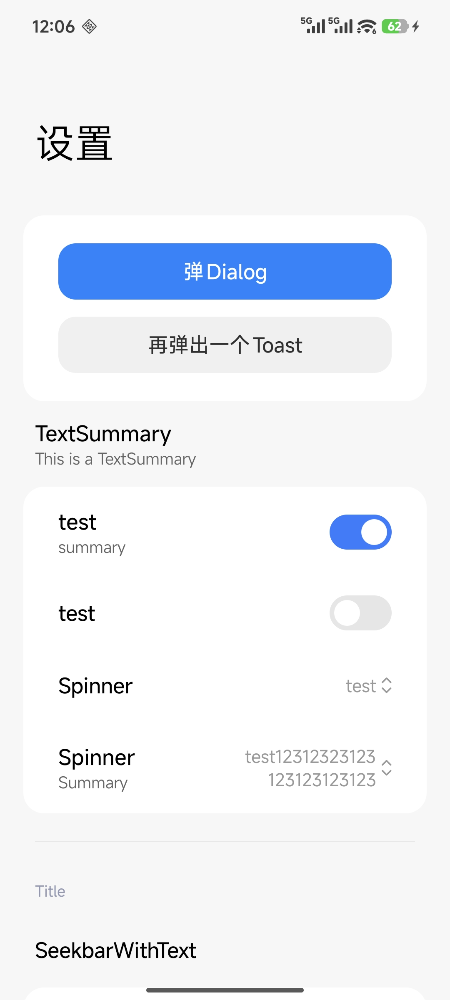
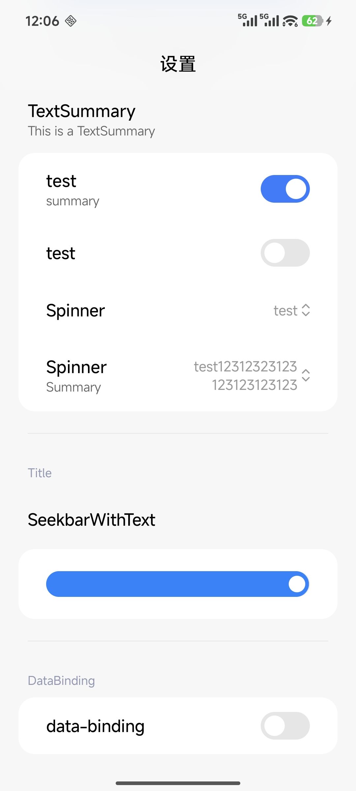
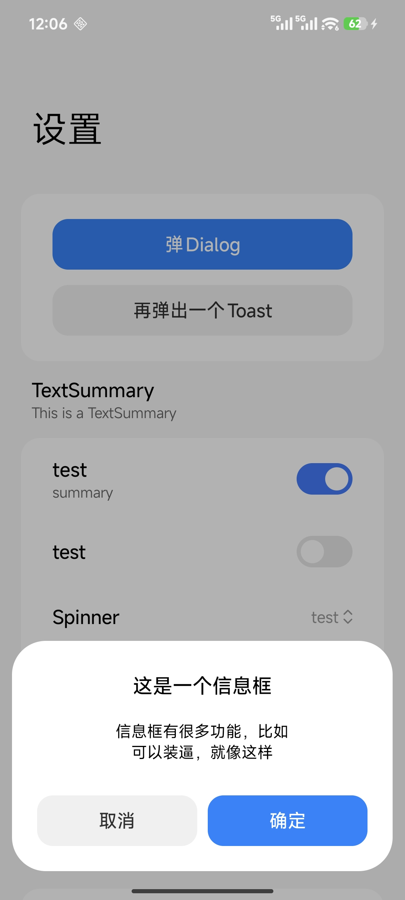
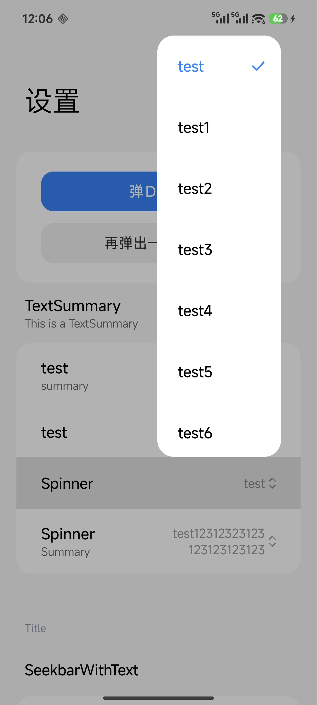
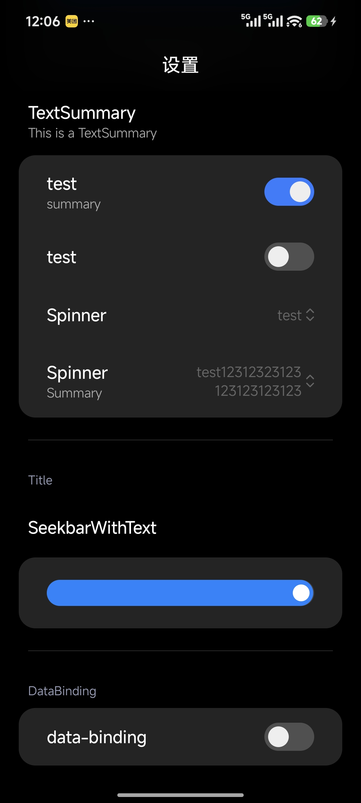
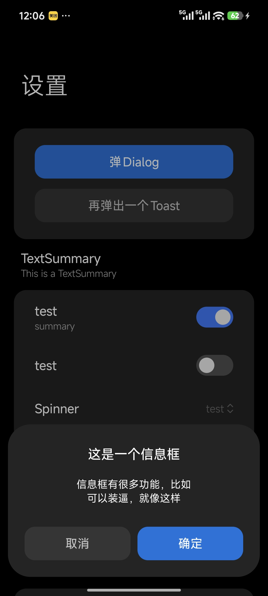
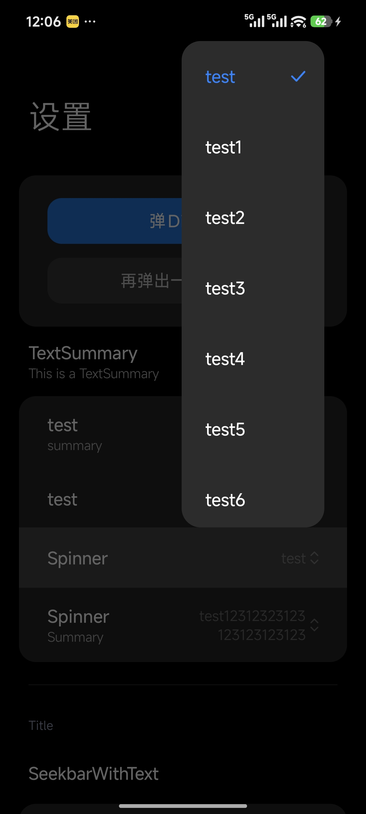

# HyperLDM

> 面向小米 HyperOS 生态的 应用基础框架  
> **作者**：EFP（零度君）  
> **当前版本**：v1.0.0  
> **包名**：com.lingdu.ldm  

---

## 📌 项目简介

**HyperLDM** 是一套为 **小米 HyperOS / MIUI 风格应用**打造的 程序开发基础框架，目标是提供：

- 与 HyperOS 设计语言一致的视觉与交互体验
- 可复用、高性能的 UI 组件与布局系统
- 便捷的主题、动画、暗色模式、适配方案

---

## ✨ 核心特性

- ✅ **HyperOS 风格组件库**：按钮、卡片、列表、对话框、导航栏等
- ✅ **主题系统**：动态配色 / 浅色暗色 / 取色规则支持
- ✅ **动画与过渡**：符合 HyperOS 节奏的动效规范
- ✅ **可扩展架构**：支持自定义组件、可插拔模块化
- ✅ **高性能渲染**：优化布局、减少重绘、缓存策略

---

## 🖼️ 效果预览

> 放一些截图 / GIF / 录屏链接

| 预览 | 描述 |
|---|---|
|  | 1 |
|  | 2 |
|  | 3 |
|  | 4 |
|  | 5 |
|  | 6 |
|  | 7 |
|  | 8 |

---

## 本项目基于什么

### 项目使用了BlockMIUI库大改

[BlockMIUI 项目 GitHub 地址](https://github.com/Block-Network/blockmiui)
